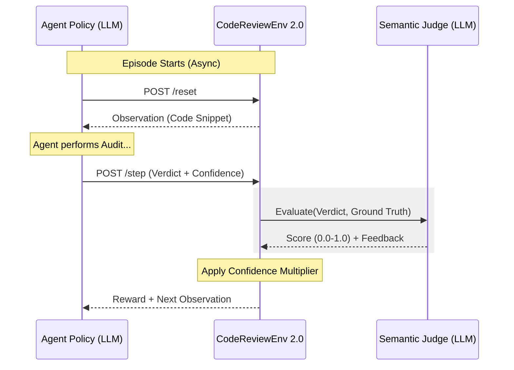

<div align="center">
  <h1>🧠 CodeReviewEnv 2.0</h1>
  <p><strong>Industrial-Grade RL Benchmarking Engine for AI Code Auditing</strong></p>
  
  [](https://github.com/facebookresearch/openenv)
  [](https://fastapi.tiangolo.com/)
  [](#)
</div>

---

## 📖 Introduction (V2.0)

**CodeReviewEnv 2.0** is an interactive reinforcement learning (RL) simulator designed to evaluate if an LLM can perform the duties of a Staff Software Engineer. 

Unlike primitive "keyword-matching" environments, V2.0 uses a **Semantic Judge** (LLM-as-a-Judge) to grade agent verdicts based on technical nuance, location precision, and confidence calibration.

---

## 🏗️ Architecture: The Semantic Loop

### The RL Loop Visualization



### The Progressive Task Curriculum (40+ Snippets)

The environment contains a scaled bank of high-complexity snippets across four tiers:

| Complexity | Task Name | Goal | Focus Areas |
| :--- | :--- | :--- | :--- |
| 🟢 **Easy** | `bug_detection` | Identify fatal bugs. | Race Conditions, Mutable Defaults. |
| 🟡 **Medium** | `code_smell` | Locate architectural odors. | God Objects, Magic Numbers. |
| 🔴 **Hard** | `improvement` | Suggest algo refactors. | O(N²) bottlenecks, Caching. |
| 🟣 **Expert** | `security_vulnerability` | Identify critical flaws. | SQLi, Pickle RCE, Path Traversal. |

---

## 📊 Reward Mechanics: Beyond Binary

V2.0 implements a **Confidence-Aware Reward Signal** to discourage hallucinations:

*   **Semantic Similarity**: The `SemanticJudge` uses a model (e.g. Qwen 72B) to compare the agent's reasoning against the ground truth.
*   **Confidence Multiplier**: 
    *   Correct + High Confidence = **1.1x Reward Bonus**
    *   Correct + Low Confidence = **0.8x Hesitation Penalty**
    *   Incorrect + High Confidence = **-0.2x Hallucination Penalty**

---

## 📁 Repository Structure

```text
my_first_env/
├── openenv.yaml                   # 📜 OpenEnv Manifest
├── README.md                      # 📖 V2.0 Marketing & Quickstart
├── PROJECT_DOCUMENTATION.md       # 🧠 Technical Architecture Deep-Dive
├── models.py                      # 🏗️ Pydantic Schemas
├── client.py                      # 📡 Client SDK (Async-ready)
├── inference.py                   # 🤖 Benchmark Evaluation Trace
├── server/
│   ├── app.py                     # 🌐 FastAPI Engine
│   ├── judge_client.py            # ⚖️ [NEW] Semantic Judge Wrapper
│   ├── graders.py                 # ⚖️ [NEW] Async Semantic Rubrics
│   ├── tasks.py                   # 📦 [NEW] Expanded Bank (40+ Snippets)
│   └── my_first_env_environment.py# 🧠 Async State Machine
├── training/
│   └── trajectory_collector.py     # 🏃 [NEW] RL Training Harness Example
└── tests/
    └── test_env.py                # 🧪 [NEW] Integration Test Suite
```

---

## 🚀 RL Training Example

To satisfy the requirement for a true RL training loop, see `training/trajectory_collector.py`. It demonstrates how a policy can interact with the client to populate a **Replay Buffer**:

```python
async with CodeReviewEnv(base_url=URL) as client:
    obs = await client.reset()
    while not obs.done:
        action = policy(obs) # Agent Policy
        result = await client.step(action)
        buffer.append(transition) # Collect experience
```

---
*Developed for the Meta x Scaler OpenEnv Hackathon.* 

