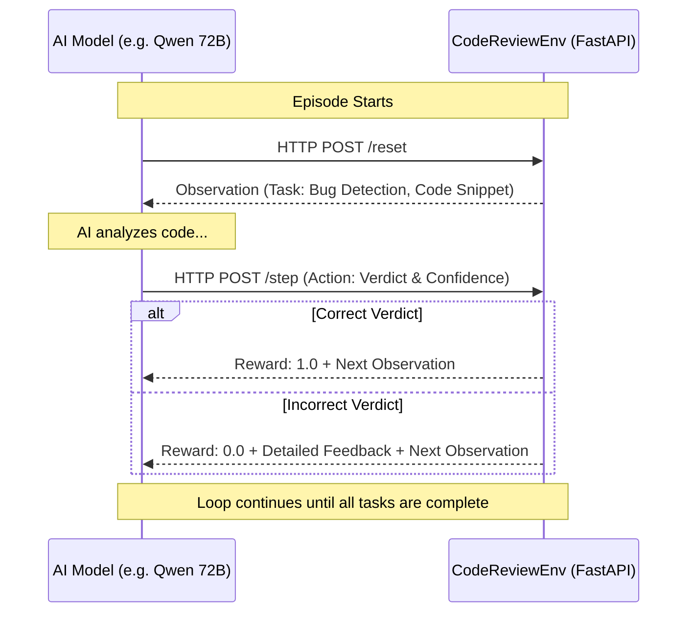

<div align="center">
  <h1>🧠 CodeReviewEnv</h1>
  <p><strong>An advanced Reinforcement Learning Evaluation Engine for Large Language Models</strong></p>
  
  [](https://github.com/facebookresearch/openenv)
  [](https://fastapi.tiangolo.com/)
  [](https://huggingface.co/)
</div>

---

## 📖 Introduction

**CodeReviewEnv** is an interactive benchmarking engine designed for the Meta x Scaler OpenEnv AI Hackathon. 

Instead of passing a static prompt to an AI, this environment acts as a **Reinforcement Learning Simulator**. It challenges an AI agent to perform the duties of a Senior Software Engineer. The AI is placed into a multi-step episode where it is progressively tested on evaluating Python code, identifying bugs, and suggesting architectural refactors.

> [!TIP]
> This environment is specifically built to test **Agentic Workflows**. It proves whether an AI can analyze code, maintain state across multiple requests, and interpret strict feedback to adjust its reasoning.

---

## 🏗️ Architecture & Code Flow

At its core, this project uses a standard **Server-Client architecture** heavily optimized for AI inference loops.

### The RL Loop Visualization



### The Progressive Task Curriculum

The environment forces the AI model to evolve through three distinct difficulty tiers during a single episode.

| Complexity | Task Name | Goal | Expected Action |
| :--- | :--- | :--- | :--- |
| 🟢 **Easy** | `bug_detection` | Identify fatal syntax errors or logic bugs (e.g., `ZeroDivisionError`). | A strict "yes/no" boolean justification. |
| 🟡 **Medium** | `code_smell` | Locate bad styling, bad variable naming, or anti-patterns in working code. | A description of the bad practice. |
| 🔴 **Hard** | `improvement` | Look at a complex but working script and suggest an actionable refactor. | A strict architectural suggestion. |

---

## 🛠️ The Technology Stack

This project leverages modern Python infrastructure to ensure millisecond-latency API responses.

*   🐍 **Python 3.11** - The core execution layer.
*   🤖 **OpenEnv Framework** - Meta's standard protocol for standardizing Agent-to-Environment communication.
*   ⚡ **FastAPI & Uvicorn** - An asynchronous HTTP web server connecting the Python logic to the internet.
*   🛡️ **Pydantic** - Strict data-validation. It ensures that if an AI hallucinates a bad JSON response, the server rejects it gracefully.
*   🐳 **Docker** - The entire engine is containerized using `python:3.11-slim` for maximum portability.
*   ☁️ **HuggingFace Spaces** - Serverless GPU/CPU deployment ensuring the environment is publicly accessible 24/7.

---

## 📁 Repository Structure

> [!NOTE]  
> All files are modular to allow researchers to easily update the task logic without breaking the server API.

```text
my_first_env/
├── openenv.yaml                   # 📜 OpenEnv Manifest (Declares tasks and models)
├── models.py                      # 🏗️ Pydantic Action/Observation Schemas
├── client.py                      # 📡 Client SDK mapping for OpenEnv
├── inference.py                   # 🤖 Benchmark Evaluation Script (Testing Qwen 72B)
├── _upload_hf.py                  # ☁️ Automated deployment script
├── server/
│   ├── app.py                     # 🌐 FastAPI wrapper exposing /reset and /step REST routes
│   ├── my_first_env_environment.py# 🧠 Core Simulation Logic (Episodes, Grading, State Management)
│   ├── requirements.txt           # 📦 Dependency list
│   └── Dockerfile                 # 🐳 Production Image Blueprint
```

---

## 🚀 How to Execute & Use

### 1. The Interactive Web UI (Human Mode)
The deployed environment automatically generates a graphical user interface (powered by Gradio). You can test the exact tasks the AI sees.

1. Navigate to: **[https://huggingface.co/spaces/mahesh16/code-review-env](https://huggingface.co/spaces/mahesh16/code-review-env)**
2. Click **Reset** to start a session.
3. Review the code snippet, type your answer in the `Verdict` box, and click **Step**.

---

### 2. Connect an AI Agent (Programmatic REST API)
Any LLM framework (LangChain, AutoGen, raw Python) can communicate directly with your engine over HTTP.

```python
import requests

BASE_URL = "https://mahesh16-code-review-env.hf.space"

# 1. Initialize the Environment
res = requests.post(f"{BASE_URL}/reset", json={})
observation = res.json()["observation"]
print(f"Target Task: {observation['task']}")
print(f"Code to evaluate:\n{observation['code_snippet']}")

# 2. Submit AI Answer
action_payload = {
    "action": {
        "task": observation["task"],
        "verdict": "yes, there is a severe bug",
        "confidence": 0.95
    }
}
new_state = requests.post(f"{BASE_URL}/step", json=action_payload)

# 3. Analyze the Environment's Grading
print("Reward Achieved:", new_state.json()["reward"])
```

---

### 3. Running the Qwen 72B Benchmark Locally
This project ships with `inference.py`, an OpenEnv Agent script that automatically calls the HuggingFace Inference Router to benchmark the `Qwen/Qwen2.5-72B-Instruct` model against your environment.

> [!IMPORTANT]
> To run this evaluation, you must have a HuggingFace Token with **"Make calls to the serverless Inference API"** enabled.

```powershell
# Set your token
$env:HF_TOKEN = "your_hf_read_token_here"

# Execute the Benchmark
python inference.py
```
