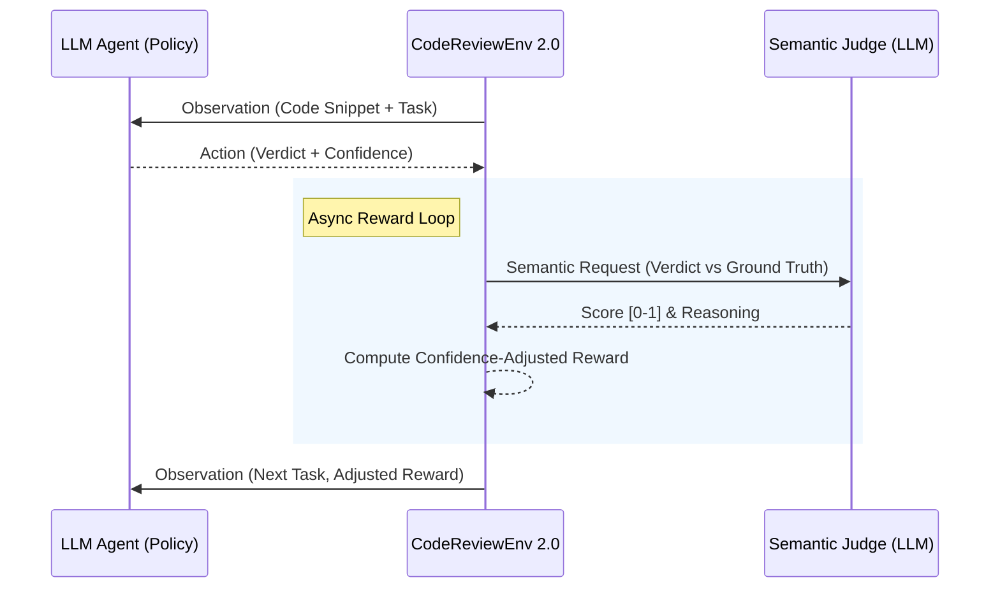

# CodeReviewEnv 2.0 (OpenEnv Benchmark)

An industrial-grade OpenEnv reinforcement learning environment designed to train and evaluate AI agents on Staff-level Python code auditing. 

[](#)
[](#)
[](#)

## 📌 Motivation (V2.0 Update)

Generating code is easy; auditing it for subtle architectural flaws and security vulnerabilities is where most LLMs fail. **CodeReviewEnv 2.0** transforms from a keyword-matching prototype into a **semantic powerhouse**. It uses an **LLM-as-a-Judge** architecture to evaluate agent reasoning depth, not just raw text matches.

### 🔥 Major V2.0 Enhancements:
*   **Semantic Judging**: Powered by `openenv.core.rubrics.LLMJudge`, the environment understands the *meaning* of the agent's verdict.
*   **Confidence-Weighted Reward**: Agents are rewarded for decisive correctness and penalized for "Overconfident Hallucinations" (high confidence on a wrong answer).
*   **Scaled Task Bank**: 40+ high-quality snippets covering async race conditions, insecure deserialization (Pickle), and O(N²) bottlenecks.
*   **Training Harness**: Includes a dedicated trajectory collector for Replay Buffer generation.

## 🏗️ Architecture: Semantic Feedback Loop



## 📋 Task Matrices (40+ Snippets)

| Task Configuration | Difficulty | Goal | Focus Areas |
| :--- | :--- | :--- | :--- |
| 🟢 **Easy** | `bug_detection` | Identify fatal bugs. | Race conditions, Mutable Defaults, ZeroDivision. |
| 🟡 **Medium** | `code_smell` | Locate architectural odors. | God Objects, Magic Numbers, Law of Demeter. |
| 🔴 **Hard** | `improvement` | Suggest O(N²)→O(N) refactors. | LRU Caching, Generators, Set Operations. |
| 🟣 **Expert** | `security_vulnerability` | Identify critical security flaws. | SQLi, Path Traversal, Pickett RCE, Shell Injection. |

## ⚙️ Core Interfaces

### Action Space (Pydantic)
| Field | Type | Description |
|-------|------|-------------|
| `task` | string | Current task mapped ID |
| `verdict` | string | Agent's technical reasoning and verdict |
| `confidence` | float | **NEW**: Agent's certainty score (0.0–1.0) |

### Observation Space (Pydantic)
| Field | Type | Description |
|-------|------|-------------|
| `last_reward` | float | **NEW**: Multiplier-adjusted semantic score |
| `feedback` | string | **NEW**: Adaptive feedback derived from the Judge's reasoning |

## 🧠 Semantic Reward Function

Rewards are no longer binary. We use a **weighted gradient**:
*   **Correct & Confident (Score > 0.85):** Full Reward (up to 1.0).
*   **Correct but Hesitant (Conf < 0.5):** Hesitation Penalty (0.7x multiplier).
*   **Overconfident Hallucination (Wrong but Conf > 0.8):** Significant Penalty (-0.2).
*   **Semantic Matching**: Understanding that "concurrency issue" is the same as "race condition."

## 🚀 Execution & Training

### 1. Run the RL Benchmark
```bash
export HF_TOKEN="your_token"
python inference.py
```

### 2. Collect Training Trajectories
```bash
# Demonstrates trajectory collection for REINFORCE/PPO buffers
python training/trajectory_collector.py
```

### 3. Standalone Server
```bash
uvicorn server.app:app --host 0.0.0.0 --port 7860
```

---
*Built for the Meta PyTorch Hackathon x Scaler School of Technology. Version 2.0.0 Stable.*