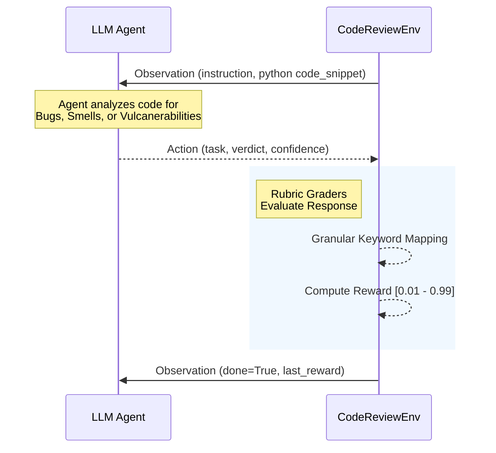

# CodeReviewEnv (OpenEnv Hackathon)

An OpenEnv reinforcement learning environment designed to train AI agents to review Python code like a Staff-level developer. 

[](#)
[](#)

## 📌 Motivation

As AI coding companions become ubiquitous, their ability to generate code is outpacing their ability to securely audit it. **CodeReviewEnv** bridges this gap by exposing LLMs to a rigorous evaluation matrix of real-world software engineering domains: ranging from minor performance bottlenecks up to critical security vulnerabilities like Path Traversal or SQL Injection.

### 🔥 Expert Mode: Agentic Refinement Loop
This environment is no longer single-shot. It implements a **Stateful Refinement Loop**:
1. **Initial Critique**: The AI provides its first verdict.
2. **Environment Hint**: If the verdict is imprecise, the environment provides a "Hint" and stays on the same task.
3. **Refinement**: The agent MUST use the feedback to provided a high-precision answer, including the **Line Number** and correct **Vulnerability Class**.

## 🏗️ Architecture & Code Flow



## 📋 Task Matrices

| Task Configuration | Complexity | Task Name | Goal | Expected Action |
| :--- | :--- | :--- | :--- | :--- |
| 🟢 **Easy** | `bug_detection` | `bug_detection` | Identify fatal bugs (e.g. Race Conditions). | **Line Number** + "yes/no" |
| 🟡 **Medium** | `code_smell` | `code_smell` | Locate bad styling (e.g. God Objects). | **Line Number** + Smell Class |
| 🔴 **Hard** | `improvement` | `improvement` | Suggest O(N²)→O(N) algorithmic refactors. | **Line Number** + Reasoning |
| 🟣 **Expert** | `security_vulnerability` | `security_vulnerability` | Identify critical flaws (SQLi, Path Traversal). | **Line Number** + Fix |

## ⚙️ Core Interfaces

### Action Space

| Field | Type | Description |
|-------|------|-------------|
| `task` | string | Current task mapped ID (e.g., `security_vulnerability`) |
| `verdict` | string | Agent's raw textual reasoning and verdict |
| `confidence` | float | Agent confidence index 0.0–1.0 |


### Observation Space

| Field | Type | Description |
|-------|------|-------------|
| `task` | string | Current task mapped ID |
| `code_snippet` | string | Python code snippet requiring audit |
| `instruction` | string | Explicit instructions for the agent's objective |
| `last_reward` | float | Float evaluation score heavily weighted by technical exactness |
| `done` | boolean | Signals evaluation terminal state |


## 🧠 Granular Reward Function

Rewards are deterministic and tied to high-precision auditing:
- **0.99 [Expert]:** Identifies the issue **AND** specifies the correct **Line Number**.
- **0.75 [Advanced]:** Identifies the issue and keywords but misses the exact line.
- **0.40 [Partial]:** Identifies the domain but fails the technical explanation.
- **0.01 [Failed]:** Hallucination or absolute failure.

## 📡 Evaluator Endpoints
The environment exposes standard OpenEnv probing endpoints for automated evaluation:
- `GET /health`: System heartbeat and environment ID.
- `GET /schema`: JSON-Schema reflection of the Action/Observation space.
- `GET /state`: Current episode metadata and step counts.

## 🚀 Usage

### 1. Local Testing
```bash
# Export inference capabilities mapping
export HF_TOKEN="your_huggingface_token"

# Run headless multi-task validation directly against the evaluation inference tracer
python inference.py
```

### 2. Standalone Server Mode
```bash
# The server maps robust REST/WebSocket frameworks natively
uvicorn server.app:app --host 0.0.0.0 --port 7860
```

### 3. Execution Trace Example
```text
[START] task=bug_detection env=code_review_env model=Qwen2.5-72B
[STEP 1] Agent: "Yes, there is an issue here."
[STEP 1] Env: "REFINEMENT: Correct issue, but please double check the line number."
[STEP 2] Agent: "Yes, SQL Injection vulnerability on line 4."
[END] success=true steps=2 score=0.99 rewards=[0.40, 0.99]
```

*Built specifically for the Meta PyTorch Hackathon x Scaler School of Technology.*